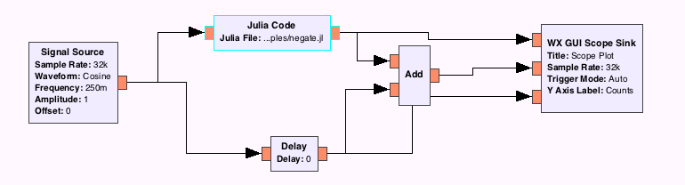

# gr-juliaffi #



gr-juliaffi is a [GNU Radio](http://gnuradio.org/redmine/projects/gnuradio/wiki) package that lets you write custom signal processing blocks in Julia.

## Installation

Until the kinks are ironed out, there is a high probability of the installation process failing. Please submit a an issue if you run into any problems.

If you have installed GNU Radio via macports, first run `setup_gr-juliaffi_clang_x64.sh` from the root of the repository.

```
git clone https://github.com/JayKickliter/gr-juliaffi.git
cd gr-juliaffi
mkdir build
cd build
cmake ..
make
sudo make install
```

## Usage

In these early stages, gr-juliaffi only has one block, `juliablock_ff`. It has one input and one output, both of type `float`. If I can't figure out a way to dynamically change the input/output parameters, I will add more blocks. In the meantime, instantiate to use the block, you'll need to create a `.jl` file with a function called `work!`. `work!` must accept two parameters. The first the output buffer, and the second is the input vector. Here's a simple example (abs.jl) included in the repository:

```julia
function abs!(y::AbstractVector, x::AbstractVector)
    for i in 1:length(x)
        y[i] = abs(x[i])
    end
    y
end

work = abs!
```

See the included [GRC](https://gnuradio.org/redmine/projects/gnuradio/wiki/GNURadioCompanion) flowgraph in `examples`.
